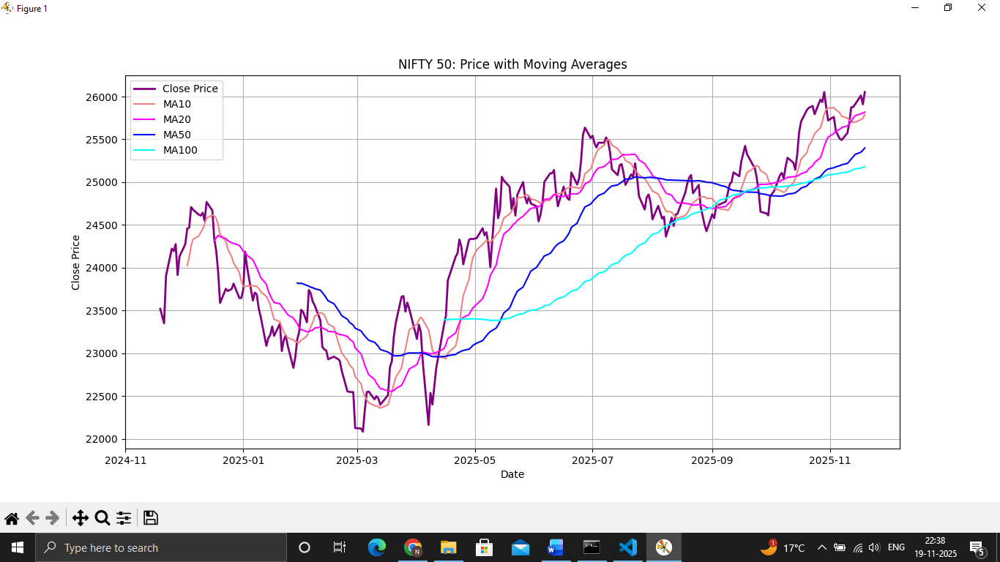
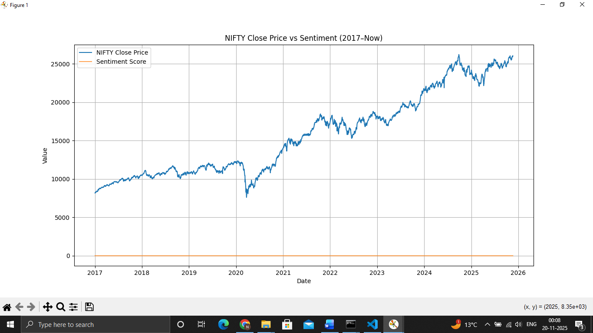
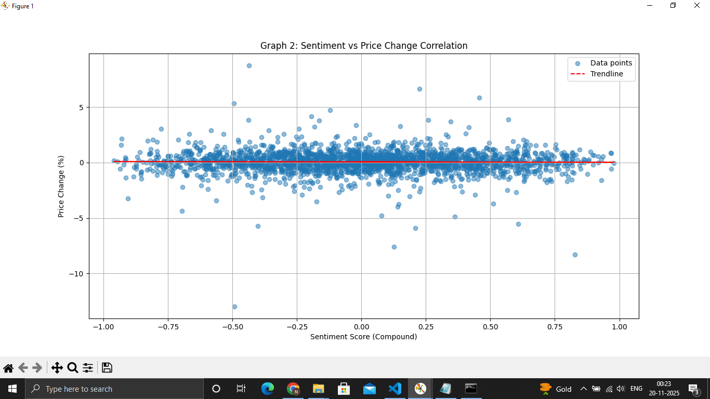
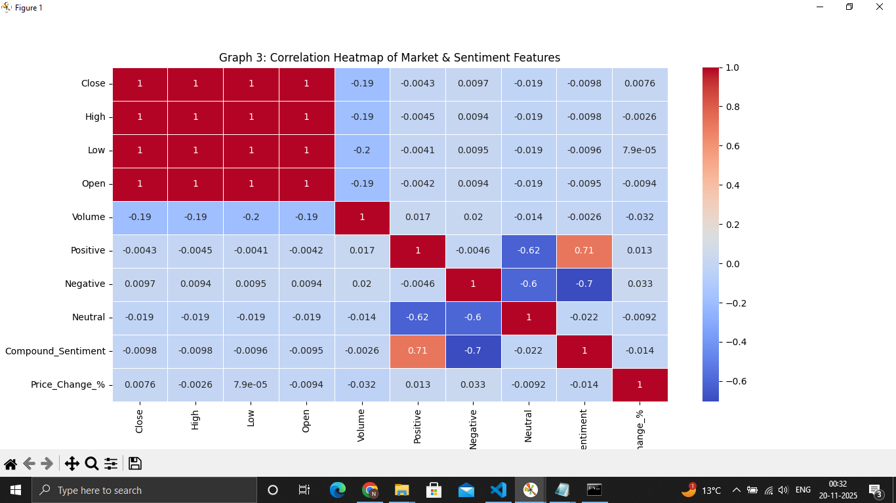
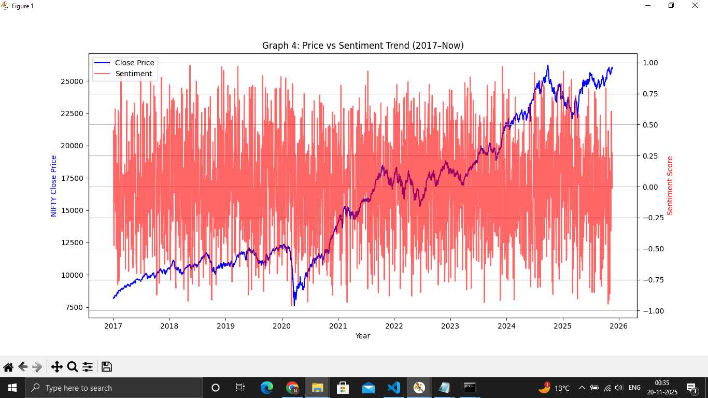
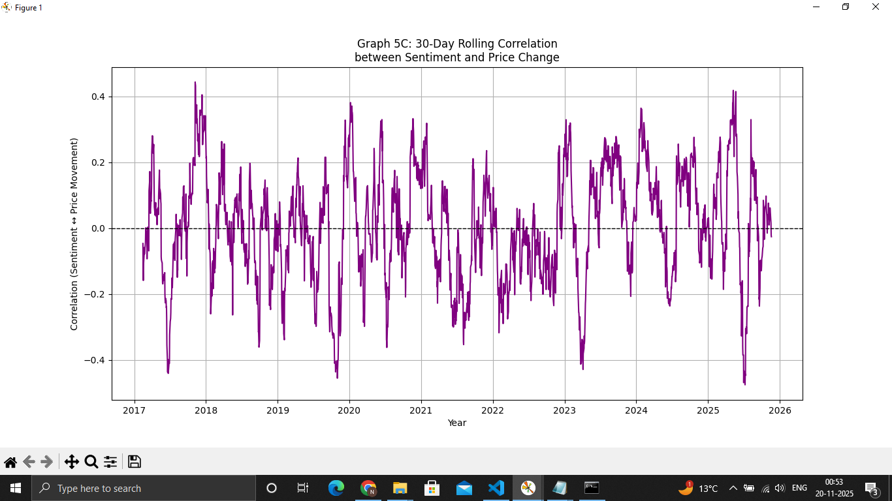
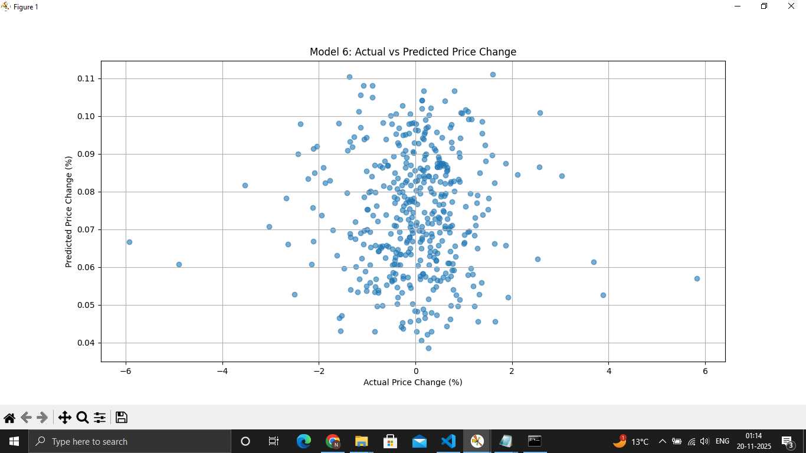
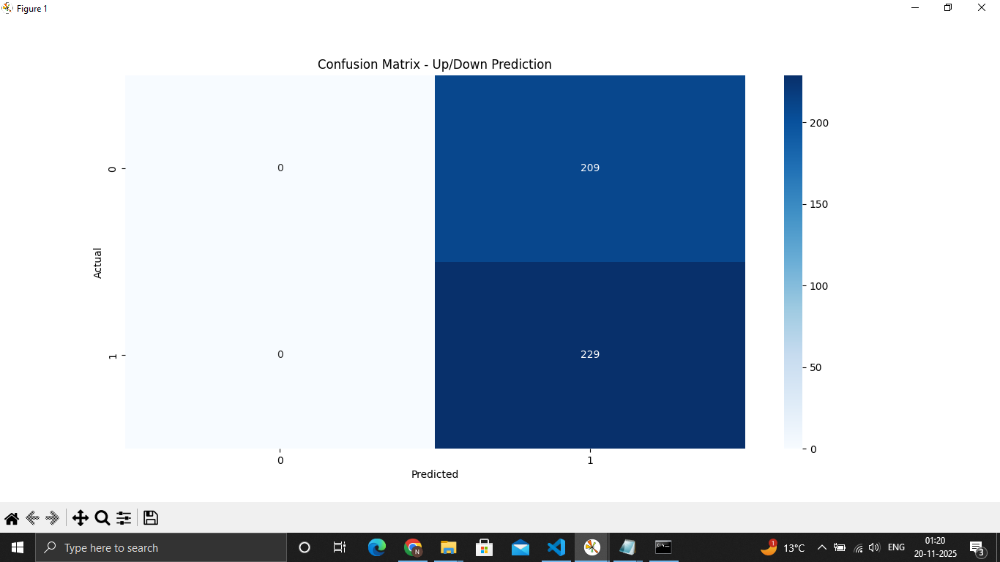
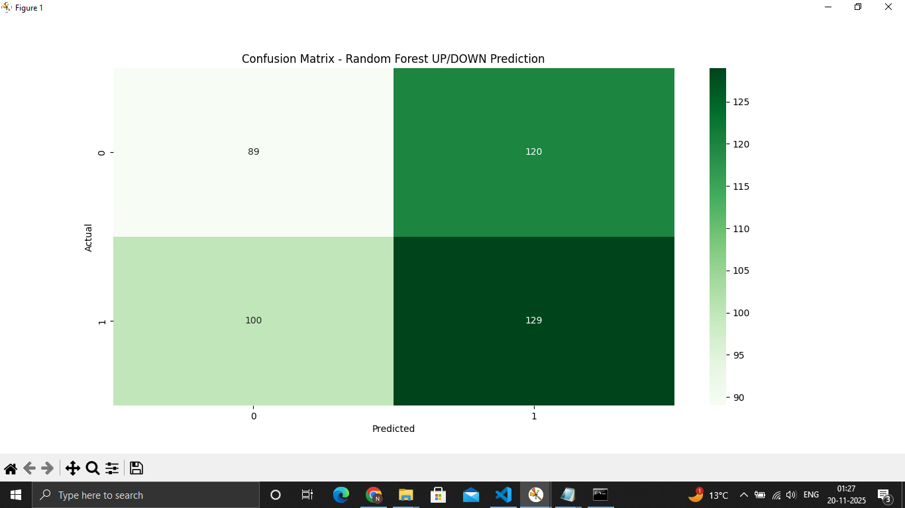

# 📈 Stock Market Sentiment Analysis & Price Movement Correlation

## 📌 Overview

This project investigates the relationship between market sentiment and NIFTY 50 price movements using historical stock market data and machine learning techniques. It integrates sentiment analysis with financial data to analyze trends, visualize correlations, and evaluate predictive models for stock price movement.

---

## 🎯 Objectives

- Collect historical NIFTY 50 market data.
- Generate sentiment scores for financial analysis.
- Preprocess and merge stock and sentiment datasets.
- Perform Exploratory Data Analysis (EDA).
- Analyze the relationship between sentiment and price movement.
- Build and evaluate machine learning models.

---

## ✨ Features

- Historical NIFTY 50 data analysis
- Sentiment score generation
- Data preprocessing and feature engineering
- Exploratory Data Analysis (EDA)
- Correlation analysis
- Data visualization
- Linear Regression
- Logistic Regression
- Random Forest Classification

---

## 🛠️ Tech Stack

**Python | Pandas | NumPy | Scikit-learn | Matplotlib | Seaborn | yfinance**

---

## 🤖 Machine Learning Models

- Linear Regression
- Logistic Regression
- Random Forest Classifier

---

## 📂 Project Structure

```text
stock-market-sentiment-analysis/
│
├── graphs/
├── merged_data.csv
├── nifty_2017_to_now.csv
├── sentiment_2017_to_now.csv
├── stock_full.py
├── sentiment.py
├── merge.py
├── graph1.py
├── graph2.py
├── graph3.py
├── graph4.py
├── graph5.py
├── model6.py
├── model7.py
├── model7A.py
├── requirements.txt
└── README.md
```

---

## 🔄 Project Workflow

1. Collect historical NIFTY 50 data using **yfinance**.
2. Generate sentiment scores.
3. Clean and preprocess datasets.
4. Merge stock and sentiment datasets.
5. Perform Exploratory Data Analysis (EDA).
6. Build machine learning models.
7. Evaluate prediction performance.
8. Visualize insights using graphs.

---

# 📊 Project Visualizations

<h3 align="center">Market Trend Analysis</h3>

<p align="center">
  
  
</p>

<p align="center">
  <em>Moving Average Analysis</em> &nbsp;&nbsp;&nbsp;&nbsp;&nbsp;&nbsp;&nbsp;&nbsp;&nbsp;&nbsp;&nbsp;&nbsp;&nbsp;&nbsp;&nbsp;&nbsp;&nbsp;&nbsp;&nbsp;&nbsp;&nbsp;&nbsp;&nbsp;&nbsp;&nbsp;&nbsp;&nbsp;&nbsp;&nbsp;&nbsp;
  <em>NIFTY Price vs Sentiment</em>
</p>

---

<h3 align="center">Correlation Analysis</h3>

<p align="center">
  
  
</p>

<p align="center">
  <em>Scatter Plot Correlation</em> &nbsp;&nbsp;&nbsp;&nbsp;&nbsp;&nbsp;&nbsp;&nbsp;&nbsp;&nbsp;&nbsp;&nbsp;&nbsp;&nbsp;&nbsp;&nbsp;&nbsp;&nbsp;&nbsp;&nbsp;&nbsp;&nbsp;&nbsp;
  <em>Feature Correlation Heatmap</em>
</p>

---

<h3 align="center">Trend Analysis</h3>

<p align="center">
  
  
</p>

<p align="center">
  <em>Price & Sentiment Trend</em> &nbsp;&nbsp;&nbsp;&nbsp;&nbsp;&nbsp;&nbsp;&nbsp;&nbsp;&nbsp;&nbsp;&nbsp;&nbsp;&nbsp;&nbsp;&nbsp;&nbsp;&nbsp;&nbsp;&nbsp;&nbsp;&nbsp;&nbsp;&nbsp;&nbsp;
  <em>30-Day Rolling Correlation</em>
</p>

---

<h3 align="center">Machine Learning Models</h3>

<p align="center">
  
  
</p>

<p align="center">
  <em>Linear Regression Prediction</em> &nbsp;&nbsp;&nbsp;&nbsp;&nbsp;&nbsp;&nbsp;&nbsp;&nbsp;&nbsp;&nbsp;&nbsp;&nbsp;&nbsp;&nbsp;&nbsp;&nbsp;&nbsp;&nbsp;
  <em>Logistic Regression Confusion Matrix</em>
</p>

<p align="center">
  
</p>

<p align="center">
  <em>Random Forest Confusion Matrix</em>
</p>

## 📈 Results

- Successfully integrated historical stock market data with sentiment scores.
- Identified correlations between market sentiment and stock price movements.
- Performed comprehensive data visualization and exploratory analysis.
- Developed and evaluated Linear Regression, Logistic Regression, and Random Forest models for stock movement prediction.

---

## 🚀 Future Improvements

- Real-time news sentiment analysis
- Twitter/X sentiment integration
- BERT-based sentiment analysis
- LSTM-based stock price forecasting
- Interactive dashboard using Streamlit or Power BI

---

## 📦 Requirements

Install the required libraries:

```bash
pip install -r requirements.txt
```

**requirements.txt**

```text
pandas
numpy
matplotlib
seaborn
scikit-learn
yfinance
```

---

## 👩‍💻 Author

**Noopur Saindane**

- GitHub: https://github.com/noopurr8

---

## ⭐ If you found this project useful, consider giving it a star!
